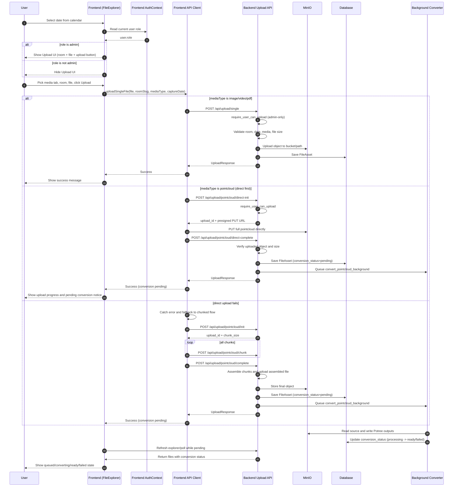

# Upload Flowchart (End-to-End)

This file documents the complete upload workflow across frontend and backend.

## Full Upload Workflow

## Key Access Rules

- Frontend gating: Upload UI appears only when `user.role === "admin"` and a date is selected.
- Backend enforcement: Upload endpoints always call `require_user_can_upload`; non-admin requests return `403`.
- Security source of truth is backend authorization; frontend check is a UX gate.
